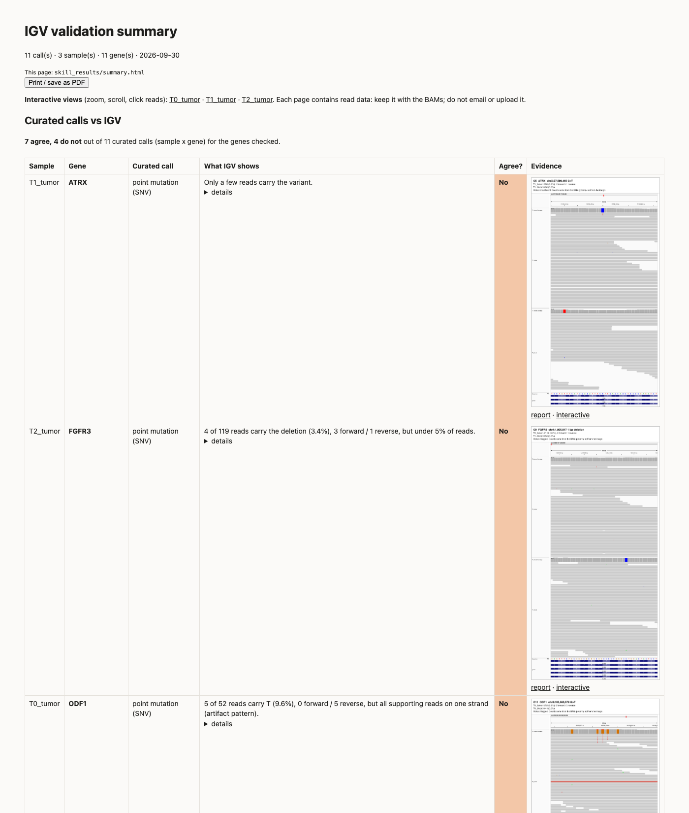
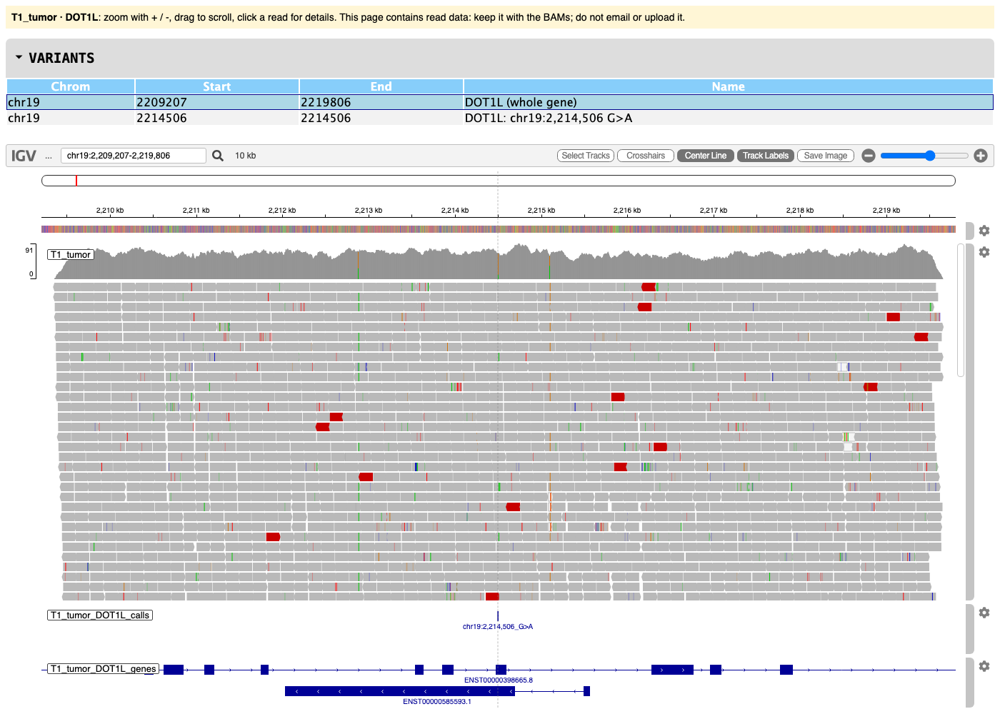
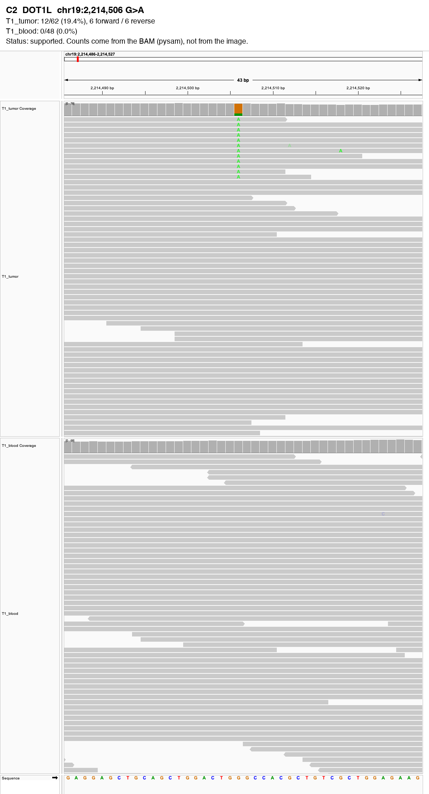
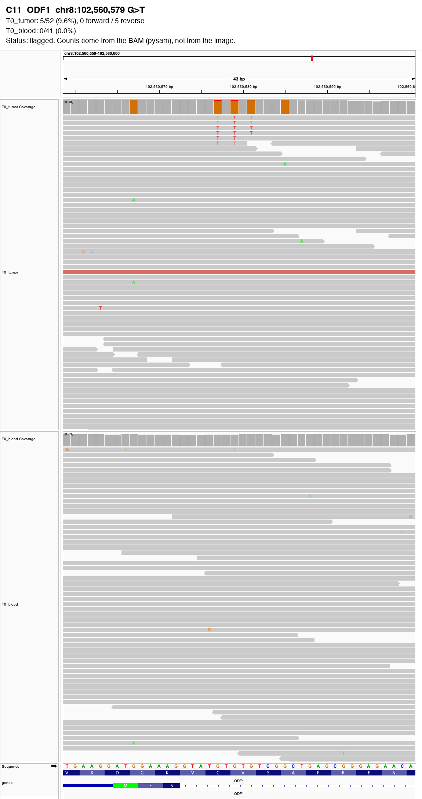

# IGV validation of osteosarcoma somatic mutations

Do the reads support the mutations the variant callers report? This repo checks 11 candidate
somatic mutations from a publicly shared osteosarcoma genome against the sequencing reads.
For each one it counts tumor and blood reads straight from the BAM files, shows the reads in IGV,
and puts everything on one summary page with zoomable, clickable views.

The checks were run with **[igv-validator](https://github.com/mgdouq-sudo/ClawBio/tree/feat/igv-validator/skills/igv-validator)**,
a [ClawBio](https://github.com/ClawBio/ClawBio) skill built from the prototype pipeline in this repo.

## What igv-validator is for (and what it isn't)

**1. Faster review and reporting.** Instead of opening IGV, loading BAMs and navigating to each gene for every
sample, one run gives a page covering all samples and genes: IGV screenshots, the gene drawn underneath,
zoomable interactive views and a plain sentence per call. It is reproducible, and a collaborator or PI can
review the evidence without using IGV.

**2. Catching errors in calls and pipelines.** Reads are counted straight from the BAM and set against what the
callers (and your curated table) say, so disagreements stand out: single-strand artifacts, sites where the
normal already carries another allele, too few reads, copy-number calls the read depth does not show, and
calls caused by how the reads were aligned (see [Why alignment settings matter](#why-alignment-settings-matter)).

**What it isn't:** a variant caller or an automatic truth. Copy number from read depth is a simple measure,
tumor-only data cannot separate inherited from somatic variants, and every verdict is a first pass. The
screenshots and interactive views are the evidence: judge each result there before reporting it.

## Data

Whole-genome sequencing shared publicly by the patient at [osteosarc.com](https://osteosarc.com)
(tumor at three time points, matched blood). Thanks to the patient for making the data open.

| Sample | Date | Lab |
|---|---|---|
| T0 tumor + blood | Dec 2022 | Personalis |
| T1 tumor + blood | Jun 2024 | UCLA |
| T2 tumor (compared with T1 blood; no T2 blood sample) | Jan 2025 | UCLA |

No BAM files are stored here. `samples.tsv` lists the source BAMs, and `skill_results/make_wide_slices.py`
downloads ±5 kb slices around each mutation. The interactive pages in `skill_results/interactive/` embed the
reads of those slices, from this openly shared genome. Reference: Broad `Homo_sapiens_assembly38.fasta`, the
build the BAMs were aligned to.

## Results

Each mutation is shown at T1 unless it was only called at another time point.

| ID | Gene | Mutation | Shown at | Tumor support | Blood | Flags | Skill status | Manual review |
|---|---|---|---|---|---|---|---|---|
| C1 | H1-2 | 15 bp in-frame deletion | T1 | 9/108 (8.3%) | 0/57 | none | supported | true |
| C2 | DOT1L | G>A p.Trp611Ter | T1 | 12/62 (19.4%) | 0/48 | none | supported | true |
| C3 | ROBO2 | C>A p.Asn1080Lys | T1 | 13/124 (10.5%) | 0/50 | none | supported | true |
| C4 | CDKN2B–PARD3B | t(2;9) translocation | T1 | 18 molecules (12 split, 6 pairs) | 0 | none | supported | true |
| C8 | MAP2 | 28 bp deletion p.Leu867fs | T1 | 29/85 (34.1%) | 0/70 | none | supported | true |
| C10 | USH2A | C>A p.Cys4728Phe | T0 | 15/40 (37.5%) | 0/37 | none | supported | true at T0 only |
| C7 | ZNRF3 | G>A p.Gly578Ser | T1 | 3/57 (5.3%) | 0/57 | none | supported | weak / unclear |
| C6 | ROS1 | G>T p.Ser2223Tyr | T1 | 6/94 (6.4%) | 0/64 | germline_site | flagged | likely artifact |
| C11 | ODF1 | G>T p.Val150Leu | T0 | 5/52 (9.6%) | 0/41 | strand_bias | flagged | artifact |
| C9 | FGFR3 | 1 bp deletion p.Pro573fs | T2 | 4/119 (3.4%) | 0/59 | low_vaf | flagged | weak / likely noise |
| C5 | ATRX | C>T p.Gly1968Arg | T1 | 2/66 (3.0%) | 0/30 | low_support; low_vaf | insufficient | not supported |

**Six mutations are well supported, three look like artifacts or noise, one is weak and one has too few reads.**
Read counts come from the BAMs (mapping quality ≥ 20, base quality ≥ 20, duplicates removed, each DNA
molecule counted once), never from the screenshots. Re-running with the current version of the skill gave
identical counts.

The skill's automatic status agrees with the manual review for 10 of 11. The exception is ZNRF3: it
just clears the thresholds at T1 (3 reads, 5.3%), but manual review also saw that it is absent at T2
despite deeper coverage. The skill checks one tumor/normal pair at a time, which is why its status is a
summary of the flags and not a verdict.

### The summary page

`skill_results/summary.html` lists the 11 candidates (as `curated_calls.csv`) against the reads: what the
call was, what IGV shows in one sentence, whether they agree, a thumbnail of the gene with the call marked, and
links to the full report, the overview image and the interactive view. Flagged calls come first, with the
reason in plain words.



### Interactive views

Each sample and gene also has a page (`skill_results/interactive/`, built with
[igv-reports](https://github.com/igvteam/igv-reports)) where you can zoom, scroll and click a read to see its
bases, mapping quality and mate. The pages open offline in any browser after cloning; GitHub shows them only
as source.



### Examples

**DOT1L, a clear somatic mutation:** 12 tumor reads carry the A, on both strands; none in blood. The gene
track underneath shows the codon it hits: the W (tryptophan, TGG) becomes TGA, a stop codon (p.Trp611Ter).



**ODF1, an artifact:** the 5 supporting reads are all on one strand and carry T's at three clustered
positions, a misalignment or damage pattern. It is absent from blood and from later tumors.



The other screenshots are in `skill_results/T1`, `T0` and `T2` (each with a full `report.md` and `report.html`).

## Why alignment settings matter

GRCh38 contains extra copies of a few highly variable regions, the *alternate-haplotype (alt) contigs*; the
MHC on chromosome 6 has seven. Genes there, such as DAXX at the edge of the MHC, match both chr6 and several
alt contigs. An aligner that knows the alt contigs are alternative versions of chr6 (BWA with its `.alt` file,
"alt-aware") keeps those reads on chr6 with good mapping quality. Without that file, the same reads fit
several places equally well, get mapping quality 0, and any caller that filters on mapping quality sees no
coverage and can report a false homozygous deletion.

This genome was aligned with BWA against the GATK GRCh38 bundle (nf-core/sarek), and its reads behave as
alt-aware alignment should:

| DAXX (chr6:33,318,558-33,323,010) | T1 tumor | T1 blood |
|---|---|---|
| Reads starting in the gene | 2,807 | 2,034 |
| Mapping quality ≥ 20 | 2,807 (100%) | 2,034 (100%) |
| Reads that also match MHC alt contigs (GL000251/252/254/255v2_alt) | 2,794 | 2,019 |

Almost every DAXX read also matches four alt contigs, yet all keep a good mapping quality. In a BAM aligned
against the same reference without the `.alt` file, those reads would have mapping quality 0.
igv-validator flags that case as `ambiguous_mapping`: the reads are there (IGV draws them hollow), and the
"deletion" comes from the alignment, not the tumor. Its synthetic demo reproduces it (`--demo-cnv`, gene
ALTGENE). To check your own BAMs: `samtools view -H your.bam | grep '^@PG'` shows the aligner command.

<details><summary>Reproduce the table (public BAM; saves its 9 MB index in the current folder)</summary>

```python
import collections, pysam
url = ("https://sid-sijbrandij-osteosarc-dataset.s3.us-west-2.amazonaws.com/"
       "genomics_reprocessing/DNA/T1_2024_BAM/preprocessing/recalibrated/tumor/BAM/tumor24.recal.bam")
bam = pysam.AlignmentFile(url)          # fetches the .bai next to it
mq, alt = collections.Counter(), 0
for r in bam.fetch("chr6", 33318557, 33323010):
    if r.is_duplicate or r.is_secondary or r.is_supplementary or not 33318558 <= r.reference_start + 1 <= 33323010:
        continue
    mq[r.mapping_quality >= 20] += 1
    alt += r.has_tag("XA") and "_alt," in r.get_tag("XA")
print(dict(mq), alt)
```
</details>

## Running igv-validator yourself

### What you need

| File | Required? | Notes |
|---|---|---|
| Tumor BAM (+ `.bai`) | yes | the normal BAM too if you have one (otherwise tumor-only) |
| Reference FASTA (+ `.fai`) | yes | the exact FASTA the BAMs were aligned to (check: the `@SQ` lines of the BAM match the `.fai`) |
| Caller outputs | at least one | SNV/indel VCF (e.g. Mutect2), SV VCF (e.g. SURVIVOR, Manta), copy-number segments (e.g. GATK `called.seg`) |
| GENCODE GTF | yes, for gene names | `gencode.v44.basic.annotation.gtf.gz` ([download](https://ftp.ebi.ac.uk/pub/databases/gencode/Gencode_human/release_44/)): where each gene is, and the gene track |
| Curated calls | optional | CSV/TSV with `sample, gene, alteration` (WT, SNV, SV, SNV+SV, DEL, AMP, LOH): your filtered, reviewed table |
| `samples.csv` | for one-command runs | one row per sample with the paths above (see below) |
| IGV desktop ≥ 2.16 | for screenshots | `module load igv` on an HPC, from a desktop session; `--no-igv` skips screenshots |
| igv-reports | for interactive pages | `pip install igv-reports` |

No BED file is needed: the genes are the curated table's by default, or `--genes A,B`, looked up in GENCODE.
A gene or sample name that does not match stops the run before anything runs, with a suggestion.

### With Claude Code (or another agent with ClawBio)

Describe what you want; Claude reads the skill, finds or asks for the files, writes `samples.csv`, runs it and
explains the results. Examples (replace names and paths with yours):

- *"Use igv-validator on samples S1 and S2. The BAMs, Mutect2, SURVIVOR and GATK outputs are under
  `<results folder>`, the reference is `<hg38.fa>`. Tumor-only. Compare with my curated calls in `<table.csv>`."*
- *"Same, but only for KRAS, BRAF and PTEN."*
- *"Check the calls in `calls.vcf` against `tumor.bam` and `normal.bam` and take IGV screenshots."*
- *"Do the GATK copy-number calls for sample S1 match the read depth in PTEN?"*
- *"Run the igv-validator demo."*

Claude asks for anything missing (file locations, the reference, tumor-only or paired).

### Without Claude Code

**1. Install** and try the demo (synthetic data, no files needed):
```bash
git clone -b feat/igv-validator https://github.com/mgdouq-sudo/ClawBio.git && cd ClawBio && pip install -e .
python skills/igv-validator/igv_validator.py --demo --output /tmp/igv_demo
```

**2. Write `samples.csv`** once, one row per sample (empty cell = skip that check; `normal` empty = tumor-only;
`cnv_sample` = the sample's name inside a multi-sample copy-number file):
```
sample,tumor,normal,snv_vcf,snv_list,sv_vcf,cnv,cnv_sample
S1,/data/bams/S1.bam,,/data/vcf/S1.mutect2.vcf,/data/filtered/S1.snvs.tsv,/data/vcf/S1.survivor.vcf,/data/cnv/S1.called.seg,
S2,/data/bams/S2.bam,/data/bams/S2_normal.bam,/data/vcf/S2.mutect2.vcf,/data/filtered/S2.snvs.tsv,,/data/cnv/S2.called.seg,
```
When file names follow a pattern, a loop writes it:
```bash
echo "sample,tumor,normal,snv_vcf,snv_list,sv_vcf,cnv,cnv_sample" > samples.csv
for s in S1 S2; do
  echo "$s,/data/bams/$s.bam,,/data/vcf/$s.mutect2.vcf,/data/filtered/$s.snvs.tsv,/data/vcf/$s.survivor.vcf,/data/cnv/$s.called.seg," >> samples.csv
done
```
`sample` must match the curated table's sample names exactly.
`snv_list` (a table with chrom and pos columns, `chr`/`start` also work) = **the filtered SNVs your curated table
was made from**, the same file your analysis reads, not a hand-picked subset. It can cover the whole genome: only
variants inside the genes are checked. Each listed variant must also be in `snv_vcf`, which supplies the caller's
read counts; one missing from the VCF is not checked. Fill it in when you compare with curated calls. Without it, every caller SNV in the genes is checked: in tumor-only data
these are mostly inherited, so the run warns, and they are listed under *details* without counting against a
curated call.

**3. Save the command as a script, once**, next to `samples.csv`. This one block writes it and shows the end
(replace the paths with yours; on an HPC, add your `module load` lines, e.g. `module load igv`, above `python`):
```bash
cat > run_igv_validation.sh <<'EOF'
#!/bin/bash
# IGV validation: each run = one new dated folder in igv_reports/ (never overwrites)
# extra options pass through, e.g.: bash run_igv_validation.sh --genes KRAS,BRAF
cd "$(dirname "$0")"
python ClawBio/skills/igv-validator/igv_validator.py \
  --samplesheet samples.csv \
  --reference /path/to/hg38.fa \
  --curated-calls curated.csv \
  --annotation gencode.v44.basic.annotation.gtf.gz \
  "$@"
EOF
tail -3 run_igv_validation.sh      # the last line should be "$@"
```
The script starts in its own folder, so anyone can run a copy. You do not edit it again to change genes (below).

**4. Run** `bash run_igv_validation.sh` and open what it prints:
`igv_reports/<date_time>/summary.html` (this run) and `igv_reports/index.html` (every run). The run folder also
holds `igv_validation_full.zip` (the whole report, to share), `genes.bed` (the coordinates used), `run_log.tsv`
and a copy of `samples.csv`.

**Fewer genes for one run**: put them after the script name (the script's last line, `"$@"`, passes them on):
```bash
bash run_igv_validation.sh --genes KRAS,BRAF,PTEN
```
- `bash run_igv_validation.sh` checks every gene in your curated table.
- `bash run_igv_validation.sh --genes ...` checks only the genes you list (curated rows for other genes are left
  out of that run). The script itself does not change.

On the summary, each row gives what IGV shows in one plain sentence (numbers under *details*), where to
start (*Look first* where the reads and the call differ, *Consistent so far* where they fit; neither is a verdict,
so open the image either way), a thumbnail, and
links: *report* opens that check's report showing only that gene (*show all genes* brings back the rest),
*overview* the gene image, *interactive* the zoomable view. The top table compares your curated calls; the folded
*Raw calls vs IGV* lists every caller call before filtering, for background.

**Next run, other samples or genes: edit and run.**
1. **Samples**: edit `samples.csv` (add or remove rows), or make a new file, e.g. `samples_batch2.csv`, and point
   the script's `--samplesheet` line at it.
2. **Genes**: add them to your curated table, or list them when you run: `bash run_igv_validation.sh --genes A,B`.
3. **Run** `bash run_igv_validation.sh`. The run gets its own dated folder; earlier runs stay as they are, and
   `igv_reports/index.html` lists all of them.

**Without a curated table**, remove the `--curated-calls` line and give the genes with `--genes`, either when you
run (`bash run_igv_validation.sh --genes KRAS,BRAF,PTEN`) or typed in the script:
```
  --genes KRAS,BRAF,PTEN
```
or from a text file, e.g. `genes.txt` with one name per line:
```
KRAS
BRAF
PTEN
```
and `--genes genes.txt` in the script. The page then compares each raw caller call with IGV instead of curated
calls. With neither a curated table nor `--genes`, the run stops and asks for genes.

**Which genes are checked**, in order:
1. `--regions genes.bed`, if given (your own coordinates).
2. `--genes`, if given. Curated rows for other genes are left out of that run.
3. Otherwise, the genes in the curated table.

**When the curated table and the samples don't line up**:
- New samples with no curated rows are still checked; they appear only under the raw calls.
- Curated rows for samples that aren't in this run are listed as "not compared".

### The modes

| Mode | What it does | Main options |
|---|---|---|
| Variant check, tumor + normal | read support in tumor and normal, caller comparison, artifact flags, one screenshot per call | `--vcf --tumor --normal` |
| Variant check, tumor-only | the same without a normal (normal-based checks skipped; cannot tell somatic from inherited) | `--vcf --tumor` |
| Structural variants | split reads and discordant pairs at both breakends; selected by gene coordinates | `--vcf --regions` |
| Copy number | segment calls vs read depth per gene; depth steps, ambiguous mapping, depth plots | `--cnv --regions` |
| Summary | one page over many samples and runs: raw calls vs the reads | `--summarize` |
| Curated calls | your final table vs IGV, one plain sentence per sample and gene | `--curated-calls` |
| Images and interactive views | gene overview images, zoomable pages, the gene track | `--overview --interactive --annotation` |
| Keeping and sharing | the page shows its path; the whole report is zipped next to it and linked as a download | default (`--no-bundle` to skip) |
| One page that stays current | `summary.html` links every report, image and interactive view; each later check refreshes it | `--project` |
| One command per run | every check for every sample from a samplesheet, into a new dated folder with its summary; an index lists all runs | `--samplesheet` |
| Counts only | no screenshots, e.g. on a compute node | `--no-igv` |

Every mode, with a prompt and a command, and every option are documented in the skill's
[SKILL.md](https://github.com/mgdouq-sudo/ClawBio/blob/feat/igv-validator/skills/igv-validator/SKILL.md).

## Validation of the counting

Before the counts were trusted they were checked five ways (`validation/VALIDATION.md`):

| Check | Result |
|---|---|
| Independent recount with `samtools mpileup` | 50/50 alt counts identical |
| Callers' own read counts (DRAGEN, Mutect2, PURPLE) | SNVs within 1–2 reads |
| Positive control: inherited heterozygous SNPs | ~50% in blood and tumor |
| Negative control: 6,050 positions without a variant | median 0.00% alt |
| Same result twice | identical |

This caught one real bug: overlapping read pairs were counted twice for indels (now fixed).

## Repository layout

| Path | What it is |
|---|---|
| `skill_results/summary.html` | The summary page (open it in a browser after cloning) |
| `skill_results/T1`, `T0`, `T2` | Per time point: report, screenshots, counts table and reproducibility bundle |
| `skill_results/overview/`, `interactive/` | Gene overview images; interactive pages per sample and gene (embed reads) |
| `skill_results/candidates.vcf`, `*_variants.tsv`, `curated_calls.csv`, `showcase_genes.bed` | The 11 mutations, which to check at each time point, the curated list and the gene windows |
| `skill_results/make_wide_slices.py`, `run_showcase.sh` | Download the BAM slices; re-run everything |
| `docs/` | Screenshots used in this README |
| `validation/` | The five validation checks and their results |
| `igv_validation_results.tsv` | Manual review verdicts from the first pass |
| `count_support.py`, `batch_T1.igv`, `caption_snapshots.py`, `make_report.py`, `run_validation.sh`, `verdicts.tsv` | The original prototype pipeline, kept for reference |
| `report/`, `snapshots_T1*/`, `support_counts_all.tsv` | Prototype outputs |

## Reproduce

Install the skill from the ClawBio fork (above) and `pip install igv-reports`, download the BAM indexes listed
in `samples.tsv` into `bams/`, the Broad hg38 FASTA into `skill_results/reference/` and the GENCODE v44 basic
GTF, then in `skill_results/` run `python make_wide_slices.py` and `bash run_showcase.sh`.

*This is a research and educational analysis, not a clinical test. It does not provide diagnoses.*
