# IGV validation report: osteosarcoma WGS

Generated 2026-09-26 by `make_report.py`. Patient data from osteosarc.com (shared publicly by the patient).

**11 candidate variants checked:** 6 true, 2 artifact, 2 weak, 1 not supported.

Each variant is shown as one tumor track above its matched blood track, at T1 (Jun 2024) unless it was only called at another time point. Read counts come from the BAM files (pysam; MAPQ>=20, base quality>=20, duplicates removed), not from the screenshots. Flags are automatic checks on those counts; the verdict is the reviewer's call after looking at the reads in IGV.

| ID | Gene | Variant | Shown at | Tumor support | Blood support | Flags | Verdict |
|---|---|---|---|---|---|---|---|
| C1 | H1-2 | chr6:26,055,824 15 bp in-frame deletion | T1 | 9/108 (8.3%) | 0/57 (0.0%) | none | **TRUE** |
| C2 | DOT1L | chr19:2,214,506 G>A p.Trp611Ter | T1 | 12/62 (19.4%) | 0/48 (0.0%) | none | **TRUE** |
| C3 | ROBO2 | chr3:77,607,853 C>A p.Asn1080Lys | T1 | 13/124 (10.5%) | 0/50 (0.0%) | none | **TRUE** |
| C4a | CDKN2B-PARD3B | t(2;9) chr9:22,007,648 breakpoint | T1 | 14 (4 split, 12 pairs) / 87 | 0 (0 split, 0 pairs) / 62 | none | **TRUE** |
| C4b | CDKN2B-PARD3B | t(2;9) chr2:205,310,103 breakpoint | T1 | 14 (4 split, 12 pairs) / 87 | 0 (0 split, 0 pairs) / 62 | none | **TRUE** |
| C5 | ATRX | chrX:77,599,465 C>T p.Gly1968Arg | T1 | 2/66 (3.0%) | 0/30 (0.0%) | fewer than 3 supporting reads | **NOT SUPPORTED** |
| C6 | ROS1 | chr6:117,301,021 G>T p.Ser2223Tyr | T1 | 6/94 (6.4%) | 0/64 (0.0%) | none | **LIKELY ARTIFACT** |
| C7 | ZNRF3 | chr22:29,049,913 G>A p.Gly578Ser | T1 | 3/57 (5.3%) | 0/57 (0.0%) | none | **WEAK / UNCLEAR** |
| C8 | MAP2 | chr2:209,694,772 28 bp deletion p.Leu867fs | T1 | 24/80 (30.0%) | 0/70 (0.0%) | none | **TRUE** |
| C9 | FGFR3 | chr4:1,805,817 del C p.Pro573fs | T2 | 4/119 (3.4%) | 0/59 (0.0%) | under 5% of reads; not seen at T1 (T1 tumor 0/66 (0.0%)) | **WEAK / LIKELY NOISE** |
| C10 | USH2A | chr1:215,650,752 C>A p.Cys4728Phe | T0 | 15/40 (37.5%) | 0/37 (0.0%) | not seen at T1 (T1 tumor 0/117 (0.0%)) | **TRUE at T0 only** |
| C11 | ODF1 | chr8:102,560,579 G>T p.Val150Leu | T0 | 5/52 (9.6%) | 0/41 (0.0%) | all on one strand (chance alone: about 1 in 16); not seen at T1 (T1 tumor 0/82 (0.0%)) | **ARTIFACT** |

## Variants

### C1 H1-2: TRUE

The same 15 bp deletion sits in a clean stack of tumor reads at every time point and is absent from blood.

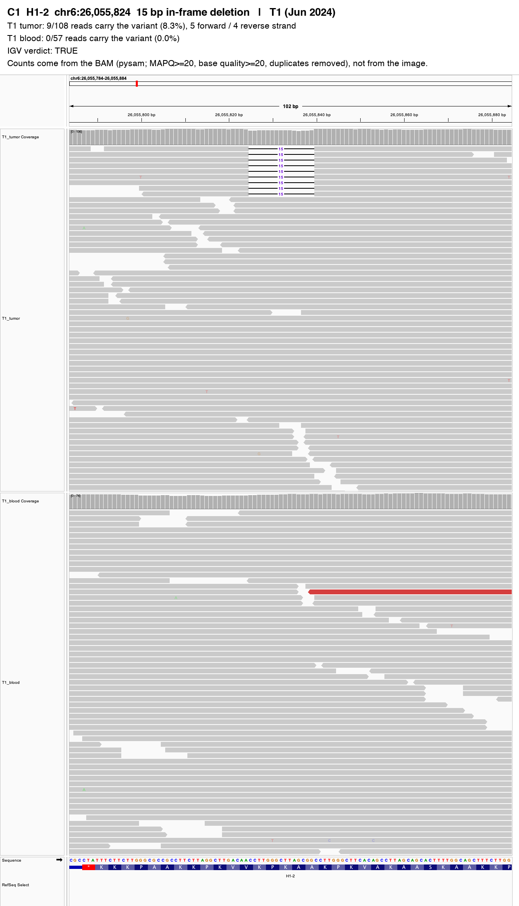

### C2 DOT1L: TRUE

Tumor reads carry the A allele on both strands; absent from T0 tumor and from blood, so it arose after T0.

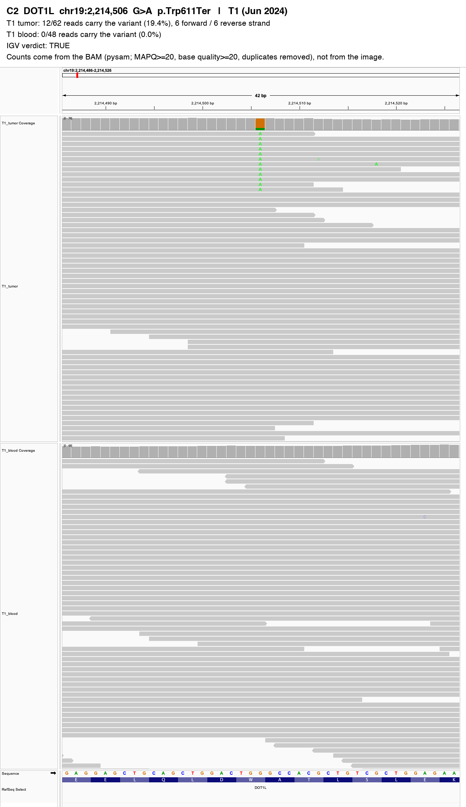

### C3 ROBO2: TRUE

Tumor reads carry the A allele on both strands at T1 and T2; absent from T0 tumor and from blood.

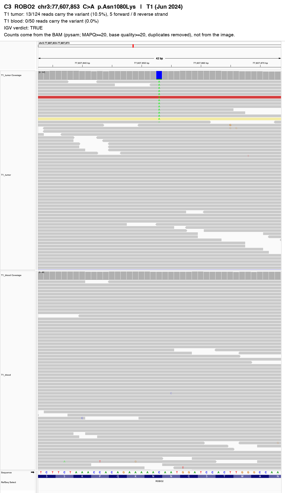

### C4a CDKN2B-PARD3B: TRUE

Tumor reads stop exactly at the chr9 breakpoint and their clipped ends or mates map to the chr2 partner; none in blood.

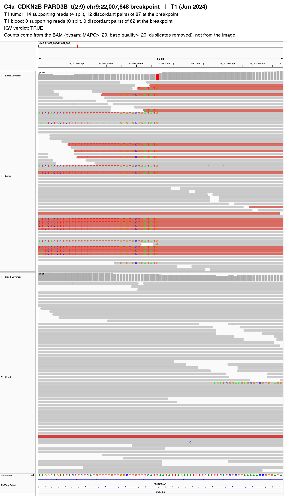

### C4b CDKN2B-PARD3B: TRUE

Partner side of the same translocation. A poly-T run causes some clipping in blood too (noise), but only tumor reads link to chr9.

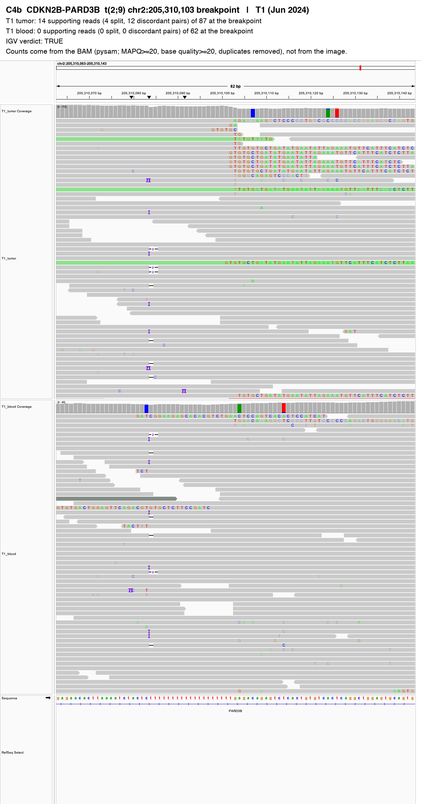

### C5 ATRX: NOT SUPPORTED

Only 2 reads carry the T allele, at T1 only; too few to separate from sequencing error.

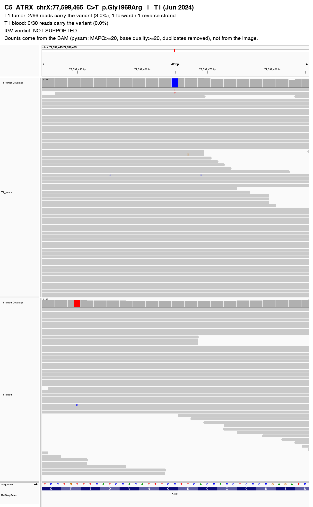

### C6 ROS1: LIKELY ARTIFACT

The site is already a germline G/C SNP in every sample, including blood; the T is a third allele in a few tumor reads.

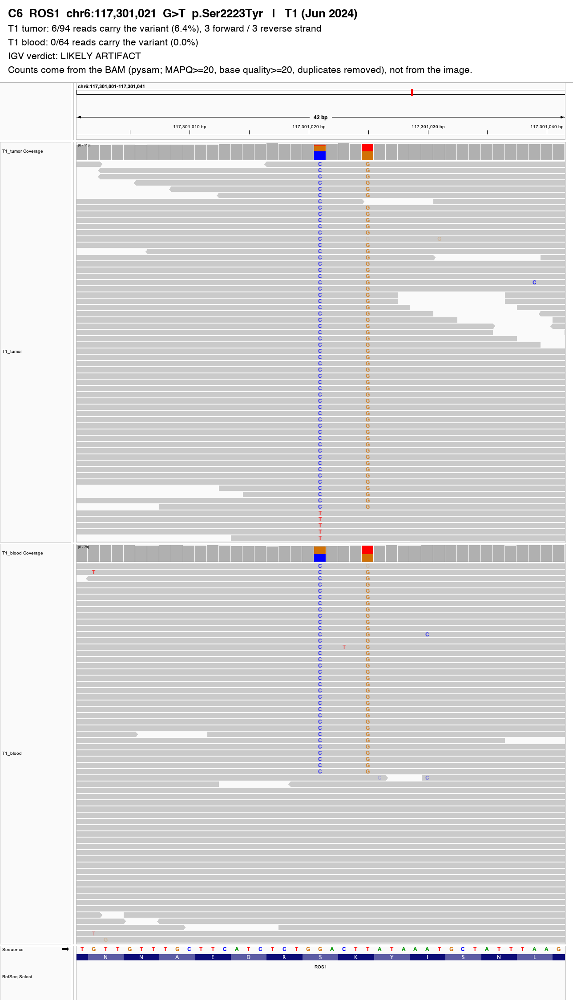

### C7 ZNRF3: WEAK / UNCLEAR

A handful of A reads at T1 only and none at T2 despite deeper coverage; needs orthogonal confirmation.

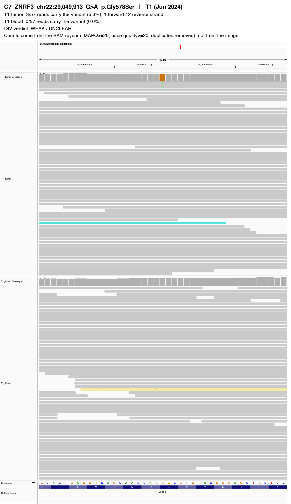

### C8 MAP2: TRUE

Clean 28 bp deletion with two mismatches just before it (a complex indel), in tumor at every time point and absent from blood.

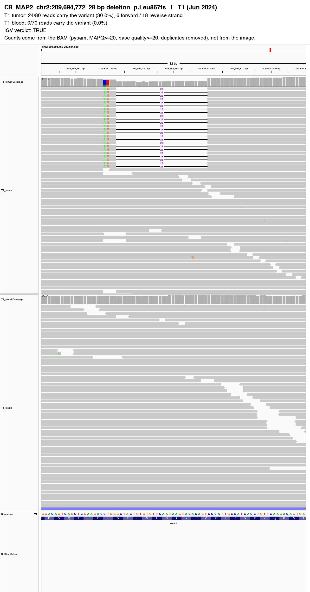

### C9 FGFR3: WEAK / LIKELY NOISE

Low-level 1 bp deletion at T2 only, in a GC-rich stretch where sequencing slippage creates false 1 bp deletions. Not seen at T1.

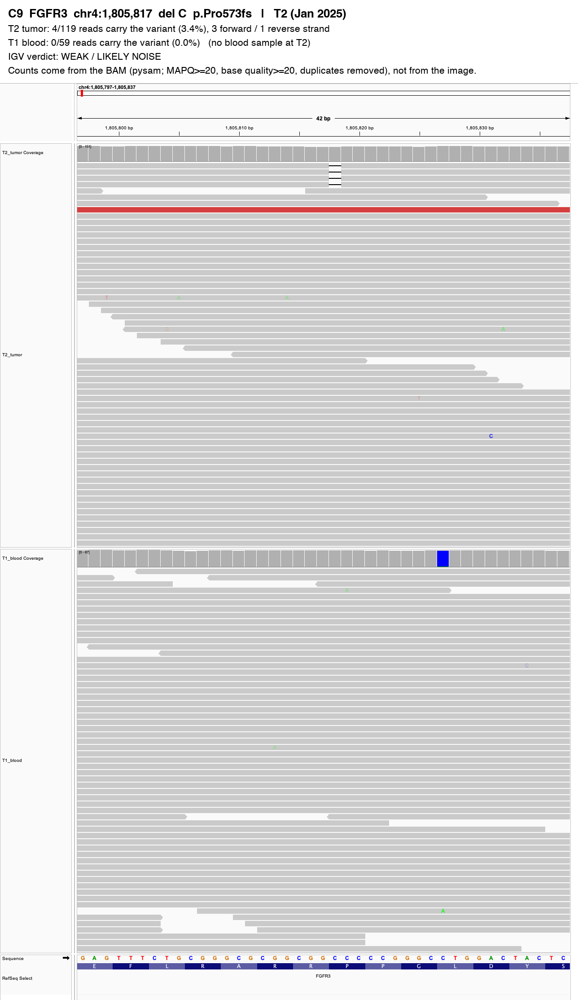

### C10 USH2A: TRUE at T0 only

Clear A allele on both strands in the T0 tumor, absent from T1, T2 and blood: a subclone not seen later. Not seen at T1.

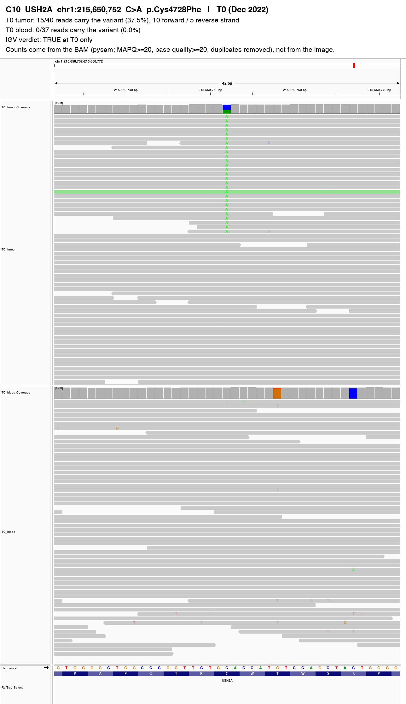

### C11 ODF1: ARTIFACT

Supporting reads carry several clustered mismatches and sit on one strand only; the same pattern appears in T1 blood. Not seen at T1.

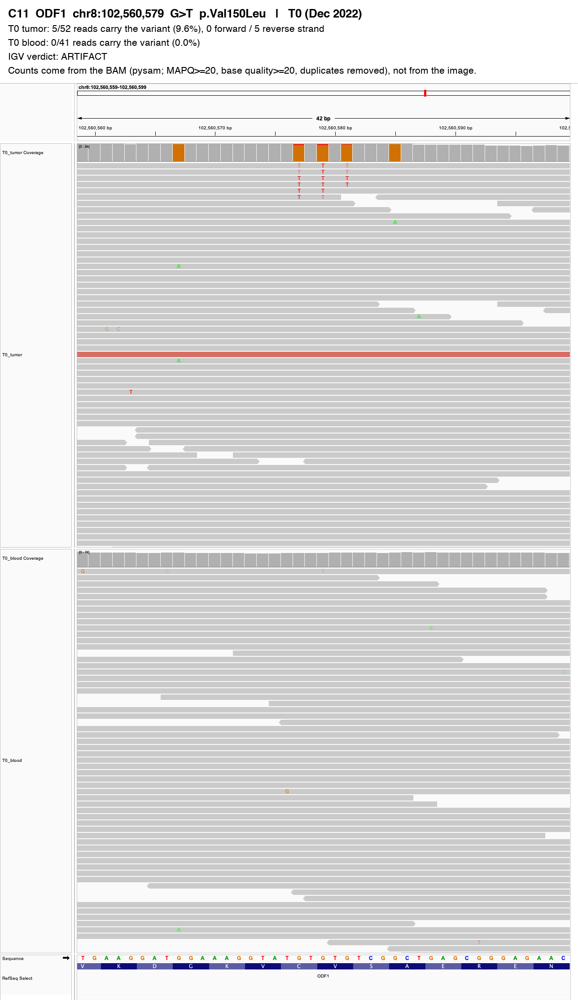

## Read support across all time points

| ID | Gene | T0 tumor | T0 blood | T1 tumor | T1 blood | T2 tumor |
|---|---|---|---|---|---|---|
| C1 | H1-2 | 10/91 (11.0%) | 0/38 (0.0%) | 9/108 (8.3%) | 0/57 (0.0%) | 7/144 (4.9%) |
| C2 | DOT1L | 0/8 (0.0%) | 0/41 (0.0%) | 12/62 (19.4%) | 0/48 (0.0%) | 15/119 (12.6%) |
| C3 | ROBO2 | 0/55 (0.0%) | 0/47 (0.0%) | 13/124 (10.5%) | 0/50 (0.0%) | 22/151 (14.6%) |
| C4 | CDKN2B-PARD3B | 13 (10 split, 8 pairs) / 62 | 0 (0 split, 0 pairs) / 33 | 14 (4 split, 12 pairs) / 87 | 0 (0 split, 0 pairs) / 62 | 14 (3 split, 12 pairs) / 117 |
| C5 | ATRX | 0/15 (0.0%) | 0/20 (0.0%) | 2/66 (3.0%) | 0/30 (0.0%) | 0/81 (0.0%) |
| C6 | ROS1 | 0/40 (0.0%) | 0/33 (0.0%) | 6/94 (6.4%) | 0/64 (0.0%) | 0/127 (0.0%) |
| C7 | ZNRF3 | 0/12 (0.0%) | 0/32 (0.0%) | 3/57 (5.3%) | 0/57 (0.0%) | 0/129 (0.0%) |
| C8 | MAP2 | 8/13 (61.5%) | 0/47 (0.0%) | 24/80 (30.0%) | 0/70 (0.0%) | 21/120 (17.5%) |
| C9 | FGFR3 | 0/9 (0.0%) | 0/36 (0.0%) | 0/66 (0.0%) | 0/59 (0.0%) | 4/119 (3.4%) |
| C10 | USH2A | 15/40 (37.5%) | 0/37 (0.0%) | 0/117 (0.0%) | 0/67 (0.0%) | 0/143 (0.0%) |
| C11 | ODF1 | 5/52 (9.6%) | 0/41 (0.0%) | 0/82 (0.0%) | 2/53 (3.8%) | 0/134 (0.0%) |

No blood sample was taken at T2, so T2 tumor calls are compared with T1 blood.
