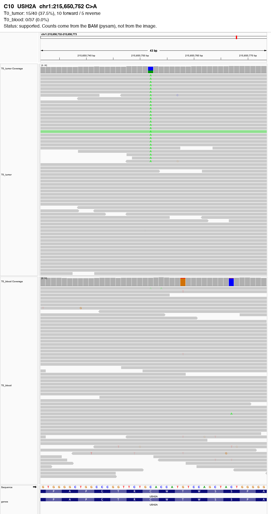

# IGV Validator Report

**Input**: `candidates.vcf` (2 variant(s) checked) · tumor: T0_tumor · normal: T0_blood
**Date**: 2026-10-08  
**Skill**: igv-validator 0.1.0

**1 supported, 1 flagged, 0 insufficient**.

> Caller counts: the VCF has no sample columns, so there are no caller counts to compare.

IGV screenshots: 2 image(s) in `figures/igv/`.

Read counts come from the BAMs (MAPQ >= 20, base quality >= 20, duplicate/secondary/supplementary reads removed, each DNA molecule counted once), never from the screenshots. **Status** is a rule-based summary of the flags, not a verdict on whether the variant is real.

| ID | Gene | Variant | Tumor support | Normal support | Caller reported (VCF) | Flags | Status |
|---|---|---|---|---|---|---|---|
| C10 | USH2A | chr1:215,650,752 C>A | 15/40 (37.5%) | 0/37 (0.0%) | - | none | **supported** |
| C11 | ODF1 | chr8:102,560,579 G>T | 5/52 (9.6%) | 0/41 (0.0%) | - | strand_bias | **flagged** |

## Flags

- `normal_support`: supporting reads in the normal
- `low_support`: fewer than 3 supporting reads
- `low_vaf`: under 5% of reads
- `strand_bias`: all supporting reads on one strand
- `read_end`: alt bases mostly within 10 bp of read ends
- `low_depth`: under 10 reads in tumor or normal
- `germline_site`: the normal carries another allele here (>= 20% of reads)
- `caller_disagrees`: the caller's reported counts (VCF AD) differ from the BAM by over 10 VAF points
- `no_coverage`: no reads at this position in either BAM (region not in the BAM, or wrong BAM/contig)
- `high_depth`: depth over 2.5x the median of this run (possible repeat or mismapped reads)

## Variants

### C10 USH2A: supported

- T0_tumor: 15/40 (37.5%), 10 forward / 5 reverse
- T0_blood: 0/37 (0.0%)
- Caller reported (VCF): -
- Flags: none

### C11 ODF1: flagged

- T0_tumor: 5/52 (9.6%), 0 forward / 5 reverse
- T0_blood: 0/41 (0.0%)
- Caller reported (VCF): -
- Flags: all supporting reads on one strand

---

## Disclaimer

*ClawBio is a research and educational tool. It is not a medical device and does not provide clinical diagnoses. Consult a healthcare professional before making any medical decisions.*
