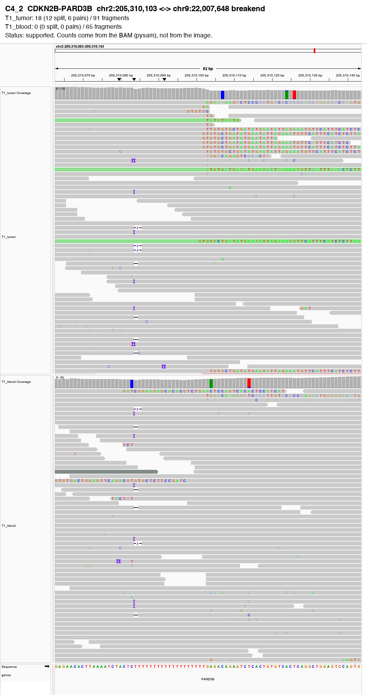
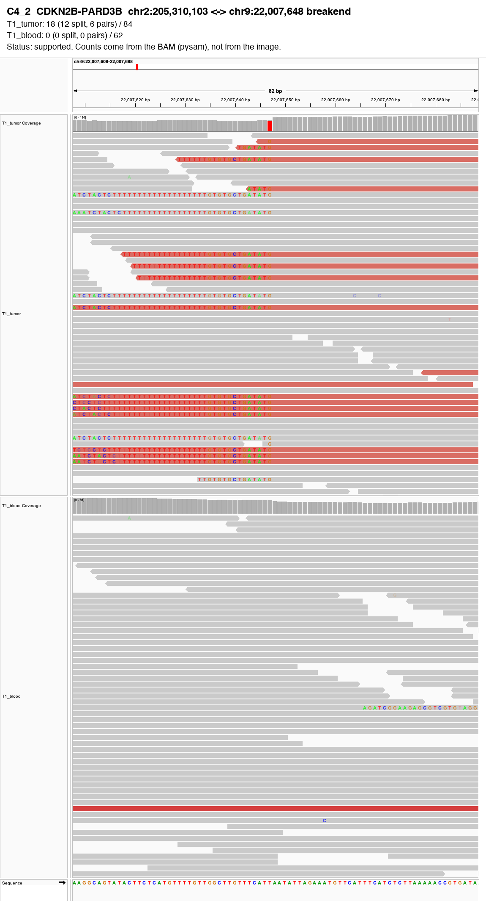
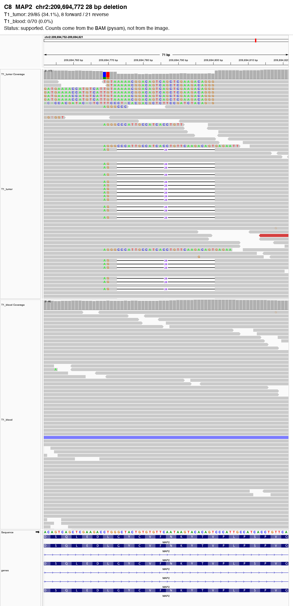
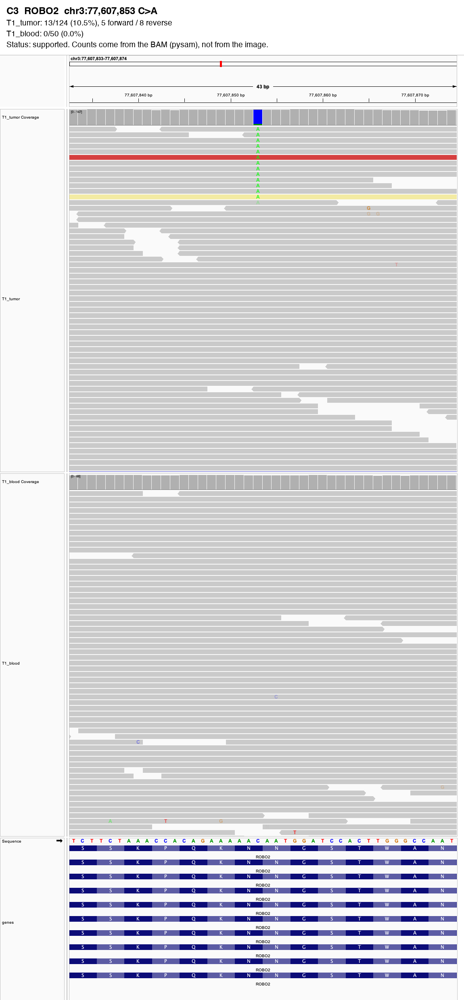
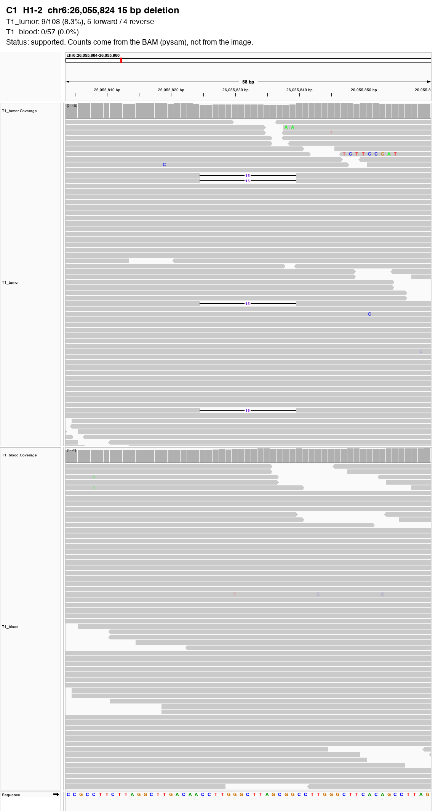
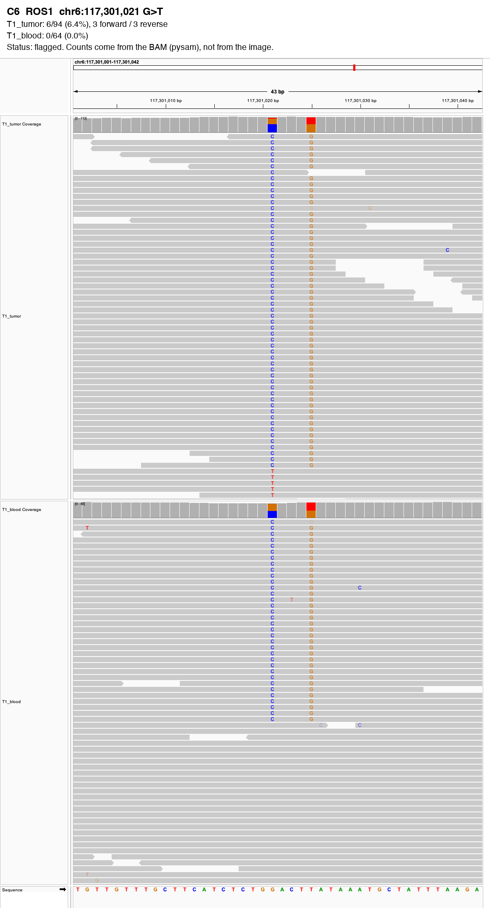
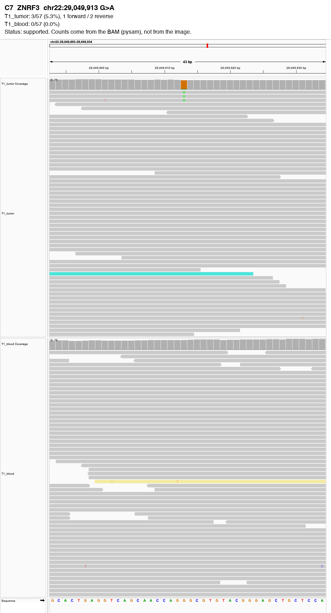
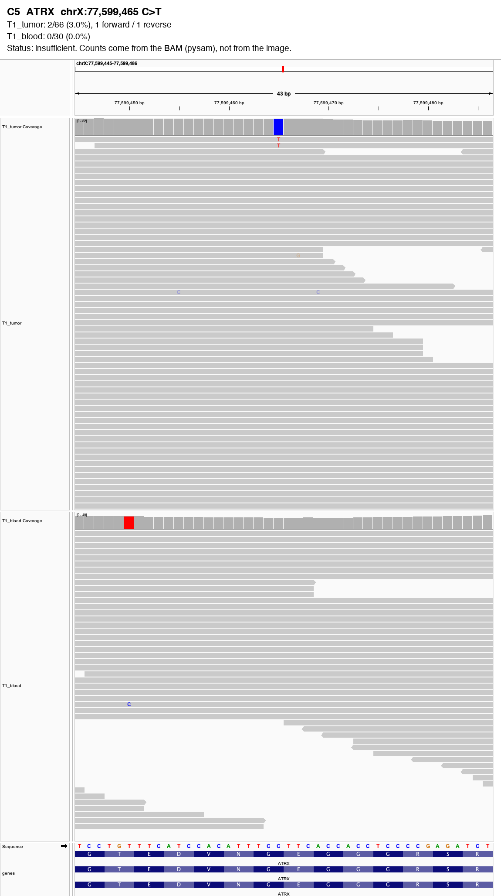

# IGV Validator Report

**Input**: `candidates.vcf` (8 variant(s) checked) · tumor: T1_tumor · normal: T1_blood
**Date**: 2026-10-06  
**Skill**: igv-validator 0.1.0

**6 supported, 1 flagged, 1 insufficient**.

> Caller counts: the VCF has no sample columns, so there are no caller counts to compare.

IGV screenshots: 9 image(s) in `figures/igv/`.

Read counts come from the BAMs (MAPQ >= 20, base quality >= 20, duplicate/secondary/supplementary reads removed, each DNA molecule counted once), never from the screenshots. **Status** is a rule-based summary of the flags, not a verdict on whether the variant is real.

| ID | Gene | Variant | Tumor support | Normal support | Caller reported (VCF) | Flags | Status |
|---|---|---|---|---|---|---|---|
| C4_2 | CDKN2B-PARD3B | chr2:205,310,103 <-> chr9:22,007,648 breakend | 18 (12 split, 6 pairs) / 84 | 0 (0 split, 0 pairs) / 62 | - | none | **supported** |
| C8 | MAP2 | chr2:209,694,772 28 bp deletion | 29/85 (34.1%) | 0/70 (0.0%) | - | none | **supported** |
| C3 | ROBO2 | chr3:77,607,853 C>A | 13/124 (10.5%) | 0/50 (0.0%) | - | none | **supported** |
| C1 | H1-2 | chr6:26,055,824 15 bp deletion | 9/108 (8.3%) | 0/57 (0.0%) | - | none | **supported** |
| C6 | ROS1 | chr6:117,301,021 G>T | 6/94 (6.4%) | 0/64 (0.0%) | - | germline_site | **flagged** |
| C2 | DOT1L | chr19:2,214,506 G>A | 12/62 (19.4%) | 0/48 (0.0%) | - | none | **supported** |
| C7 | ZNRF3 | chr22:29,049,913 G>A | 3/57 (5.3%) | 0/57 (0.0%) | - | none | **supported** |
| C5 | ATRX | chrX:77,599,465 C>T | 2/66 (3.0%) | 0/30 (0.0%) | - | low_support; low_vaf | **insufficient** |

## Flags

- `normal_support`: supporting reads in the normal
- `low_support`: fewer than 3 supporting reads
- `low_vaf`: under 5% of reads
- `strand_bias`: all supporting reads on one strand
- `read_end`: alt bases mostly within 10 bp of read ends
- `low_depth`: under 10 reads in tumor or normal
- `germline_site`: the normal carries another allele here (>= 20% of reads)
- `caller_disagrees`: the caller's reported counts (VCF AD) differ from the BAM by over 10 VAF points
- `no_coverage`: no reads at this position in either BAM (region not in the BAM, or wrong BAM/contig)
- `high_depth`: depth over 2.5x the median of this run (possible repeat or mismapped reads)

## Variants

### C4_2 CDKN2B-PARD3B: supported

- T1_tumor: 18 (12 split, 6 pairs) / 84
- T1_blood: 0 (0 split, 0 pairs) / 62
- Caller reported (VCF): -
- Flags: none

### C8 MAP2: supported

- T1_tumor: 29/85 (34.1%), 8 forward / 21 reverse
- T1_blood: 0/70 (0.0%)
- Caller reported (VCF): -
- Flags: none

### C3 ROBO2: supported

- T1_tumor: 13/124 (10.5%), 5 forward / 8 reverse
- T1_blood: 0/50 (0.0%)
- Caller reported (VCF): -
- Flags: none

### C1 H1-2: supported

- T1_tumor: 9/108 (8.3%), 5 forward / 4 reverse
- T1_blood: 0/57 (0.0%)
- Caller reported (VCF): -
- Flags: none

### C6 ROS1: flagged

- T1_tumor: 6/94 (6.4%), 3 forward / 3 reverse
- T1_blood: 0/64 (0.0%)
- Caller reported (VCF): -
- Flags: the normal carries another allele here (>= 20% of reads)

### C2 DOT1L: supported

- T1_tumor: 12/62 (19.4%), 6 forward / 6 reverse
- T1_blood: 0/48 (0.0%)
- Caller reported (VCF): -
- Flags: none

### C7 ZNRF3: supported

- T1_tumor: 3/57 (5.3%), 1 forward / 2 reverse
- T1_blood: 0/57 (0.0%)
- Caller reported (VCF): -
- Flags: none

### C5 ATRX: insufficient

- T1_tumor: 2/66 (3.0%), 1 forward / 1 reverse
- T1_blood: 0/30 (0.0%)
- Caller reported (VCF): -
- Flags: fewer than 3 supporting reads, under 5% of reads

---

## Disclaimer

*ClawBio is a research and educational tool. It is not a medical device and does not provide clinical diagnoses. Consult a healthcare professional before making any medical decisions.*
