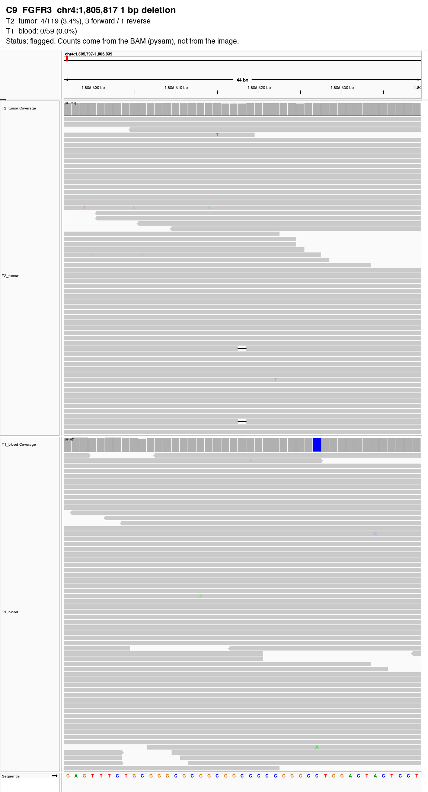

# IGV Validator Report

**Input**: `candidates.vcf` (1 variant(s) checked) · tumor: T2_tumor · normal: T1_blood
**Date**: 2026-09-26  
**Skill**: igv-validator 0.1.0

**0 supported, 1 flagged, 0 insufficient**.

IGV screenshots: 1 image(s) in `figures/igv/`.

Read counts come from the BAMs (MAPQ >= 20, base quality >= 20, duplicate/secondary/supplementary reads removed, each DNA molecule counted once), never from the screenshots. **Status** is a rule-based summary of the flags, not a verdict on whether the variant is real.

| ID | Gene | Variant | Tumor support | Normal support | Flags | Status |
|---|---|---|---|---|---|---|
| C9 | FGFR3 | chr4:1,805,817 1 bp deletion | 4/119 (3.4%) | 0/59 (0.0%) | low_vaf | **flagged** |

## Flags

- `normal_support`: supporting reads in the normal
- `low_support`: fewer than 3 supporting reads
- `low_vaf`: under 5% of reads
- `strand_bias`: all supporting reads on one strand
- `read_end`: alt bases mostly within 10 bp of read ends
- `low_depth`: under 10 reads in tumor or normal
- `germline_site`: the normal carries another allele here (>= 20% of reads)
- `no_coverage`: no reads at this position in either BAM (region not in the BAM, or wrong BAM/contig)
- `high_depth`: depth over 2.5x the median of this run (possible repeat or mismapped reads)

## Variants

### C9 FGFR3: flagged

- T2_tumor: 4/119 (3.4%), 3 forward / 1 reverse
- T1_blood: 0/59 (0.0%)
- Flags: under 5% of reads

---

## Disclaimer

*ClawBio is a research and educational tool. It is not a medical device and does not provide clinical diagnoses. Consult a healthcare professional before making any medical decisions.*
